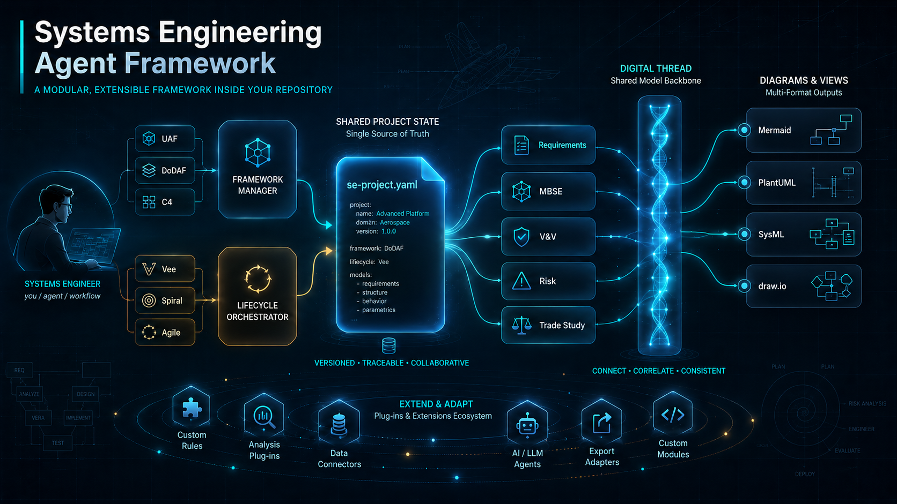
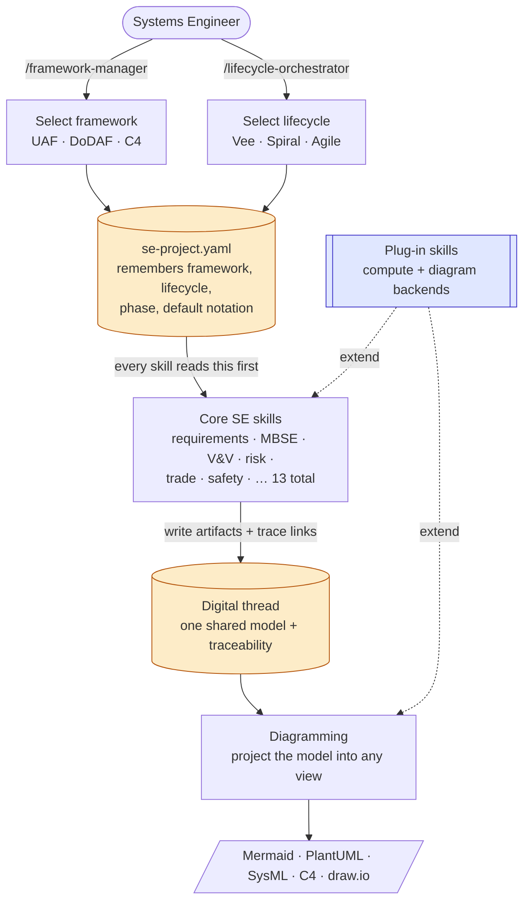

# Systems Engineering Skills



**An agent framework for systems engineering.** Select an architecture framework
(UAF, DoDAF, C4, or your own) and a lifecycle, and a set of Claude Code skills walks
you through the work — requirements, MBSE, V&V, risk, trade studies, safety, and more —
keeping everything in one shared model and projecting it into whatever diagram notation
you need. Compute and diagramming are plug-in points, so third-party skills (e.g. a
draw.io renderer or an external solver) extend the framework without changing its core.

## Concept at a glance

The spine is **select → store → operate → visualize**, with plug-ins on the sides:



You pick a framework and a lifecycle → they are saved in `se-project.yaml` (the
memory) → the core skills read that state and do the work → results collect in the
shared digital thread → diagramming projects the one model into whatever notation/view
you ask for → compute and diagram plug-ins extend it without touching the core.

## Architecture

Every file in the repo and how they relate:

```mermaid
flowchart TB
  subgraph REPO["systems-engineering-skills/ (repo)"]
    README[README.md]
    STATE[(se-project.yaml<br/>framework · lifecycle · phase<br/>model IR + trace)]
    subgraph META["meta (4)"]
      FM[framework-manager]
      LO[lifecycle-orchestrator]
      SR[skill-router]
      DT[digital-thread]
    end
    subgraph CORE["core (13)"]
      RE[requirements-engineering]
      MA[mission-analysis]
      MBSE[mbse-modeling]
      VV[verification-validation]
      TS[trade-study]
      RISK[risk-management]
      SAF[safety-analysis]
      CYB[cybersecurity]
      CM[config-management]
      OPS[operations-sustainment]
      PM[project-management]
      HSI[human-system-integration]
      RAM[ram-analysis]
    end
    subgraph DIAG["diagramming (2)"]
      DG[diagram-generation]
      DTK[diagram-toolkit]
    end
    subgraph FW["frameworks/"]
      UAF[uaf.yaml]
      DODAF[dodaf.yaml]
      C4[c4.yaml]
      FWSCHEMA[_schema.yaml]
    end
    subgraph REG["registry/ — extension points"]
      RCOMP[compute.yaml]
      RDIAG[diagram-backends.yaml]
    end
    subgraph LIB["lib/ — built-in compute"]
      RELPY[reliability.py]
      EVMPY[evm.py]
      MCPY[monte_carlo.py]
      SWAPPY[swap_budget.py]
    end
  end
  subgraph EXT["External plugins (installed separately)"]
    DRAWIO[drawio-skill]
    OTHERD[excalidraw / mermaid / plantuml-server]
    EXTCALC[3rd-party calc skills]
    MCP[MCP tools / services]
  end

  FM --> UAF & DODAF & C4
  UAF -.conforms.-> FWSCHEMA
  FM -->|writes framework, notation| STATE
  LO -->|writes phase, gates| STATE
  DT -->|owns model + trace| STATE
  SR -.routes intent.-> RE
  SR -.routes intent.-> DG
  RE -->|read state / write artifacts| STATE
  RAM -.needs calc.-> RCOMP
  PM -.needs calc.-> RCOMP
  RISK -.needs calc.-> RCOMP
  MBSE -.needs calc.-> RCOMP
  RCOMP ==> LIB
  RCOMP ==> EXTCALC
  RCOMP ==> MCP
  DG -->|reads model| DT
  DG -->|view → active viewpoints| FW
  DTK -.select backend.-> RDIAG
  RDIAG ==> DG
  RDIAG ==> DRAWIO
  RDIAG ==> OTHERD
  classDef state fill:#FDECC8,stroke:#B45309;
  classDef ext fill:#FDECC8,stroke:#B45309;
  class STATE state
  class REG,EXT ext
```



## How persistence works

Claude Code skills are **stateless** — typing `/diagram-generation` just loads that
skill's instructions; it does not inherit a framework from an earlier call. Persistence
lives in **`se-project.yaml`**: `framework-manager` and `lifecycle-orchestrator` write
the active framework/lifecycle/phase there, and **every skill reads it first**. That is
what lets you set UAF once and have every later skill honor it — across a whole session
and the next one.

- **Framework vs. notation are different axes.** UAF / DoDAF / C4 are *frameworks*
  (viewpoint vocabularies), selected and persisted via `framework-manager`. Mermaid /
  PlantUML / SysML / draw.io are *notations*, chosen per diagram (or defaulted from
  state). Selecting the `c4` framework sets Context/Container/Component as the views;
  the notation renders them.
- **Switching frameworks re-projects, it doesn't rebuild.** Because the model lives in
  the digital thread, `framework-manager select dodaf` then re-renders the same model as
  DoDAF views.

## Layout

```
systems-engineering-skills/
├── README.md
├── CLAUDE.md                   # standing instruction: read se-project.yaml, then the active framework/lifecycle manifest
├── se-project.example.yaml     # copy to se-project.yaml per project (or let framework-manager create it)
├── .claude/skills/             # 19 skills, each a folder with SKILL.md (populate under /)
│   ├── framework-manager  lifecycle-orchestrator  skill-router  digital-thread    # meta (4)
│   ├── requirements-engineering … ram-analysis                                     # core (13)
│   └── diagram-generation  diagram-toolkit                                         # diagramming (2)
├── frameworks/                 # framework manifests (data): uaf, dodaf, c4, _schema
├── lifecycles/                 # lifecycle manifests (data): vee, spiral, agile-hybrid, waterfall, incremental, sustainment, _schema
├── registry/                   # extension points: compute.yaml, diagram-backends.yaml
└── lib/                        # built-in deterministic compute modules (not skills)
```

**How the agent stays framework-aware:** `se-project.yaml` holds only the *pointer*
(`framework: dodaf`). `CLAUDE.md` — always in context — instructs the LLM that once it
knows the framework, it must read that framework's manifest (`frameworks/dodaf.yaml`)
for the viewpoints and their descriptions before producing anything. So a direct request
like "make an OV diagram" triggers: read `se-project.yaml` → read `frameworks/dodaf.yaml`
→ see OV-1/OV-2/OV-5b with descriptions → render the right one. Detail is loaded on
demand, never pinned to every turn.

## Extending the framework

Both extension points are registry files — add a row, no core change:

- **Calculation** — `registry/compute.yaml` maps a capability id (`reliability`, `evm`,
  `monte_carlo`, …) to a provider: a built-in `lib/` module, an external calc skill, or
  an MCP tool.
- **Diagramming** — `registry/diagram-backends.yaml` maps notations/intents to a
  backend: the built-in `diagram-generation`, an external skill like
  [`drawio-skill`](https://github.com/Agents365-ai/drawio-skill), or an MCP tool. Any
  backend that consumes the shared model and returns the declared output is
  interchangeable with the built-in one.

## Quick start

1. `cp se-project.example.yaml se-project.yaml` (or run `/framework-manager select uaf`).
2. `/framework-manager select uaf` — sets the framework + default notation.
3. `/lifecycle-orchestrator select-model vee` — sets the lifecycle and first phase.
4. Work the phases: `/mission-analysis`, `/requirements-engineering`, `/mbse-modeling`, …
5. `/diagram-generation` — projects the model into the active framework's views;
   pass `intent`/`notation` for a one-off view (e.g. `intent=c4 notation=mermaid`).

## Provenance

Consolidates two earlier iterations: v1's
lifecycle-phase organization and v2's contract-first rigor, collapsing v2's
parameter-axis skill explosion (34 diagram skills → 1 `diagram-generation`) into
capability skills with modes.
